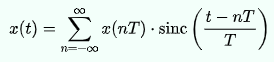
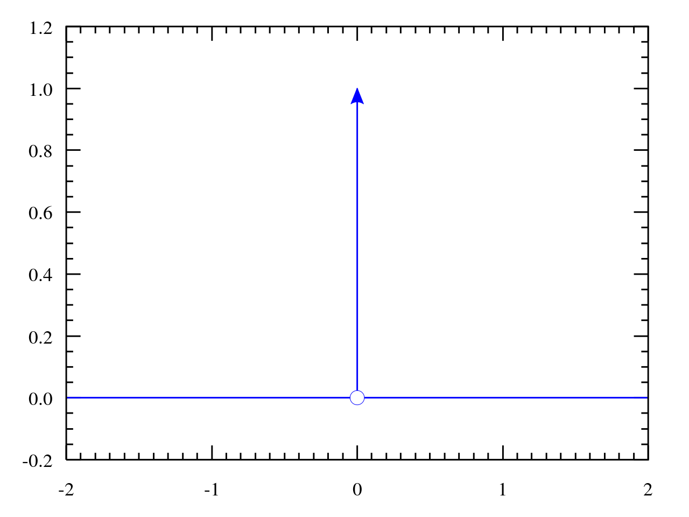

# Hi!, This is...DSP with Python

## What is DSP?

Digital Signal Processing

A <u>signal</u> is the evolution of a phisical phenomenon.
ej:

- weather ------> temperature
- sound --------> pressure (neasuring the preasure with a microphone)
- sound -----> magnetic deviation (ifbthe sound is recorded in a tape)

The <u>processing</u> part is where we make sense of this information that has been described by the signal. We can process the signal in two ways.

We can <u>analyze</u> it, namely we want to understand the information carried by the signal and perhaps extract some more high level description. Or we can <u>synthesize</u> a signal, that's also signal processing. And that's when we create a physical phenomenon that contains a certain amount of information, that we want to put out in the world. And this is really what we do when we transmit information, like when we use our cell phone or the radio, or when we generate sounds with a music synthesizer.

If we talk about audio, the question is: what <q> is the function that describe a audio signal?</q>
We cant answer the question in the analog space but we can work in a digital signal.

In the digital space we have, the time and the amplitude.

How to go to a continuos time representation to a discrete time sequence representation?

The answer was desciver by the founding fathers:

The sampling theoreme
The relationship between the continuous time a presentation of a signal, and its discrete time counterpart is given by this formula.

We can build the continuous stamp representation as a linear combination of copies of a typical function or building block called the sinc shifted and scaled by the values of the discrete time sequence.

The sinc it's actually an infinite support function that keeps oscillating from minus infinity to plus infinity, and the sampling theorem graphically looks like so. You start with a continuous times signal and then you take measurements.

<i>The normalized sinc function: sin(πx) / (πx) ... showing the central peak at x = 0, and zero-crossings at the other integer values of x.</i>

You start with a continuous times signal and then you take measurements

Convert this to a discreet time sequence

To go back to continuous time, all you need to do is take copies of the sync function and place them at each sample location scaled by the amplitude of the sample.
And when you do that, and then you sum all these copies of the sync together, you get back exactly the original function.

The conditions under which you can do this are given by at the statement of the sampling theorem, and will require a tool called Fourier analysis.

The Fourier transform will give us a quantitative measure of how fast a signal moves. And once we know this speed, we will always be able to choose a sampling interval, namely a space between measurements when we convert a function to a sequence that will satisfy the hypothesis of the sampling theory. So we have said that digital signals are composed of two ingredients. And we have talked, at length, about discretization of time.

Now, let's look at the other aspect of discretization of amplitude. Take for instance this sign wave. The first discretization happens in time, and we get a discrete set of samples. And then, the second discretization happens in amplitude. Where each sample can take values now only amongst a predetermined set of possible levels. And the very important consequence of discretization is that independently on the number of levels, the set of levels is countable. So we can always map the level of the sample onto an integer.

<b><u>THE DISCRTETE-TIME SIGNAL IS A SEQUENCE OF COMPLEX NUMBERS</u></b>

## Prototipical signals:

### Delta signal

Very short amplitude in time.
